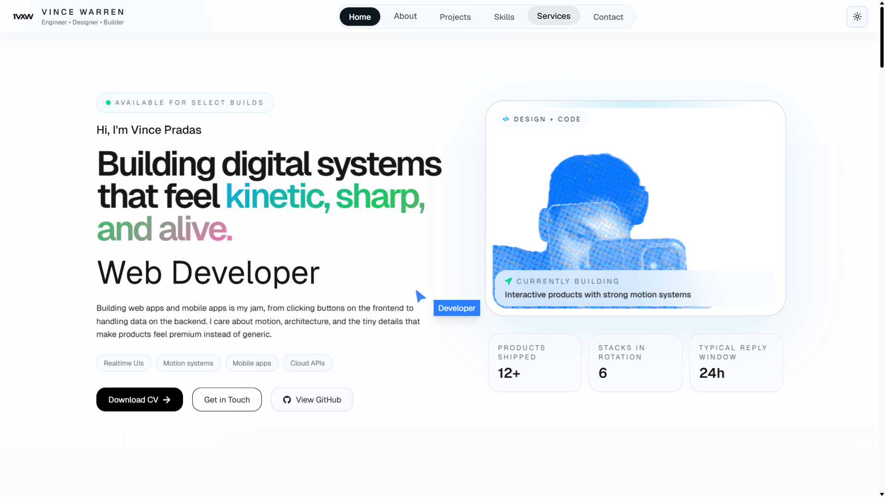

# Portfolio Website

A modern, responsive portfolio website showcasing my skills, projects, and experience as a developer. Built with cutting-edge technologies and featuring smooth animations, interactive components, and a comprehensive technology showcase.

## PREVIEW

**[https://vincewarrenpradas.dev](https://vincewarrenpradas.dev)**



### **Modern Design**
- **Clean, minimalist interface** with black & white theme
- **Dark/Light mode toggle** with seamless theme switching
- **Responsive design** that works perfectly on all devices
- **Smooth animations** powered by GSAP and Framer Motion

### **Interactive Components**
- **Auto-moving cursor** with dynamic tracking
- **Scroll-based animations** and parallax effects
- **Smooth scrolling** with Lenis
- **Logo loop animations** and velocity-based scroll effects

### **Portfolio Sections**
- **Hero Section** - Eye-catching introduction with animated elements
- **About Section** - Personal background and professional journey
- **Skills Section** - Comprehensive technology showcase with 100+ tools
- **Projects Section** - Featured work and case studies
- **Header Navigation** - Smooth navigation with scroll indicators

### **Technology Showcase**
- **10 categories** of skills and tools
- **Smart abbreviation system** for easy recognition
- **Hover effects** and smooth transitions
- **Theme-compatible icons** that work in both light and dark modes

## **Tech Stack**
### **Core Framework**
- **Vite 5** - Lightning-fast dev server and build tooling
- **React 19.1.0** - Latest React with concurrent features
- **TypeScript** - Type-safe development

### **Styling & UI**
- **Tailwind CSS 4.1** - Utility-first CSS framework
- **Tailwind Scrollbar Hide** - Custom scrollbar styling
- **Class Variance Authority** - Component variant management
- **Lucide React** - Beautiful icon library

### **Animation**
- **GSAP 3.13** - Professional animation library
- **Framer Motion** - React animation library
- **Lenis** - Smooth scrolling experience

### **Additional Libraries**
- **Next Themes** - Theme switching functionality
- **React Icons** - Extended icon collection
- **Math.js** - Advanced mathematics
- **LDRS** - Loading animations


## **Project Structure**

```
portfolio/
|-- public/                 # Static assets
|-- src/
|   |-- sections/           # Main portfolio sections
|   |   |-- Hero.tsx        # Landing hero section
|   |   |-- About.tsx       # About me section
|   |   |-- Skills.tsx      # Technology showcase
|   |   `-- Projects.tsx    # Projects portfolio
|   |-- assets/             # Images and media
|   |-- styles/             # Global styles
|   |-- components/         # Reusable components
|   |   |-- ui/             # UI components
|   |   |-- Header.tsx      # Navigation header
|   |   |-- AutoMovingCursor.tsx # Interactive cursor
|   |   |-- LogoLoop.tsx    # Animated logo loop
|   |   |-- ScrollVelocity.tsx # Scroll animations
|   |   `-- FlowingMenu.tsx # Animated menu
|   |-- lib/
|   |   `-- utils.ts        # Utility functions
|   |-- App.tsx             # App root
|   |-- main.tsx            # Vite entry
|   `-- vite-env.d.ts
|-- components.json         # shadcn/ui config
|-- vite.config.ts          # Vite configuration
`-- index.html              # Vite HTML entry
```

## **Key Components**

### **Skills Section**
- **Comprehensive Technology Grid**: 100+ technologies organized in 10 categories
- **Smart Icons**: B&W theme-compatible icons with intelligent abbreviations
- **Categories**: Frontend, Backend, Mobile, Database, Cloud, UI/UX, DevOps, Testing, Package Managers, OS
- **Interactive**: Hover effects, smooth animations, responsive grid

### **Animation System**
- **GSAP Integration**: Professional-grade animations with ScrollTrigger
- **Smooth Scrolling**: Lenis-powered smooth scroll experience
- **Responsive Animations**: Optimized for all screen sizes

### **Theme System**
- **Dark/Light Toggle**: Seamless theme switching with Next Themes
- **Consistent Styling**: B&W design that works perfectly in both modes
- **Icon Adaptation**: Technology icons automatically adapt to theme changes

## **Connect With Me**

- **Portfolio**: [vincewarrenpradas.dev](https://vincewarrenpradas.dev)
- **GitHub**: [@1vxw](https://github.com/1vxw)
- **LinkedIn**: [Connect with me](https://linkedin.com/in/vincepradas)

**Vince Pradas 2026**

